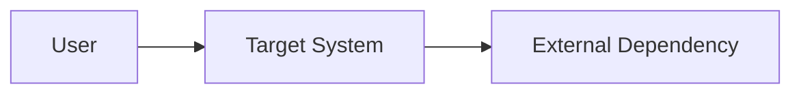

# System Context

## Scope

## Actors and External Systems

| Actor/System | Responsibility | Data exchanged | Trust boundary |
|---|---|---|---|

## Context Diagram

## Assumptions and Constraints

## Source Events and Decisions
